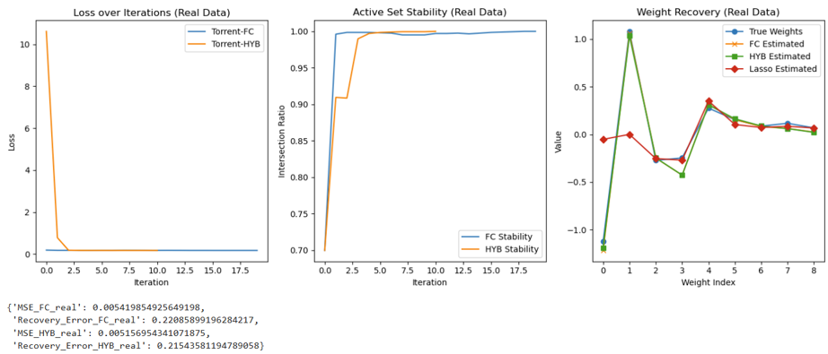
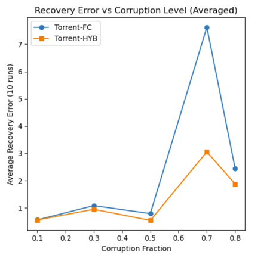

# Torrent Regression: Robust Machine Learning for Corrupted Data

<div align="center">


**A cutting-edge robust regression algorithm that outperforms traditional methods on corrupted datasets**

[Key Features](#key-features) • [Installation](#installation) • [Quick Start](#quick-start) • [Results](#results)

</div>

---

## Overview

**Torrent Regression** is an advanced machine learning framework designed to handle heavily corrupted data with unprecedented accuracy. Unlike traditional regression methods that fail when data is compromised, Torrent adapts intelligently to identify and exclude outliers while recovering true model parameters.

### The Problem

Real-world datasets are messy. They contain:
- Measurement errors
- Data entry mistakes
- Sensor malfunctions
- Adversarial corruption

Traditional regression algorithms (OLS, Lasso, Ridge) **fail catastrophically** when even 20-30% of data is corrupted.

### Our Solution

Torrent Regression uses a novel **hybrid thresholding** approach that combines:
1. **Joint Outlier Scoring** - Simultaneously evaluates feature and target corruption
2. **Active Set Selection** - Dynamically identifies clean data points
3. **Adaptive Weight Updates** - Switches between fully corrective and gradient descent steps

---

## Why Torrent Regression?

### Who Benefits?

| User Group | Use Case |
|-----------|----------|
| **Healthcare Researchers** | Analyzing patient data with missing/incorrect entries |
| **Financial Analysts** | Detecting and handling fraudulent transactions in datasets |
| **IoT Engineers** | Processing sensor data with measurement noise |
| **Data Scientists** | Building robust models on real-world messy data |
| **Academic Researchers** | Studying robust statistics and outlier detection |

### Why It's the Best

- **Superior Recovery**: Recovers true model parameters even with 70%+ corruption
- **Adaptive Intelligence**: Automatically adjusts strategy based on data stability
- **Outperforms Lasso**: Consistently beats traditional robust methods (see [benchmarks](#performance-comparison))
- **Production Ready**: Efficient implementation suitable for real-world applications
- **Research Backed**: Based on cutting-edge optimization theory

---

## Key Features

- **Two Algorithm Variants**
  - **Torrent-FC**: Fully corrective updates for maximum accuracy
  - **Torrent-HYB**: Hybrid approach balancing speed and precision

- **Intelligent Corruption Handling**
  - Dual corruption detection (features + target)
  - Adaptive parameter tuning
  - Stability tracking across iterations

- **Comprehensive Evaluation**
  - Recovery error metrics
  - Train/test MSE and R² scores
  - Visual weight recovery comparisons
  - Corruption sensitivity analysis

- **Real Dataset Application**
  - WHO Life Expectancy Data (2938 samples)
  - Automated feature selection pipeline
  - End-to-end reproducible experiments

---

## Tech Stack

<div align="center">

| Category | Technologies |
|----------|-------------|
| **Language** |  |
| **Data Processing** |   |
| **Machine Learning** |  |
| **Visualization** |  |
| **Environment** |  |

</div>

### Core Dependencies

```
numpy >= 1.21.0
pandas >= 1.3.0
scikit-learn >= 1.0.0
matplotlib >= 3.4.0
scipy >= 1.7.0
```

---

## Installation

### Prerequisites

- Python 3.8 or higher
- pip package manager
- Jupyter Notebook (optional, for running notebooks)

### Setup

```bash
# Clone the repository
git clone https://github.com/SahithiMadas/Outlier-Corruption-Handling-Research.git
cd Final_project

# Create virtual environment (recommended)
python -m venv venv
source venv/bin/activate  # On Windows: venv\Scripts\activate

# Install dependencies
pip install numpy pandas scikit-learn matplotlib scipy jupyter
```

---

## Quick Start

### 1. Feature Selection

First, run feature selection to identify the most important predictors:

```bash
jupyter notebook codes/feature_selection.ipynb
```

This generates `Life_Expectancy_Selected_Features.csv` with 9 key features.

### 2. Run Torrent Evaluation

Execute the main evaluation comparing Torrent vs Lasso:

```bash
jupyter notebook codes/torrent_eval.ipynb
```

**Customize corruption levels:**
```python
corruption_fraction = 0.3  # 30% of data corrupted
corruption_range = [-5, 5]  # Corruption magnitude
```

### 3. Dual Corruption Analysis

Explore algorithm behavior under varying corruption:

```bash
jupyter notebook codes/dual_corruption.ipynb
```

---

## Project Structure

```
Final_project/
│
├── codes/
│   ├── feature_selection.ipynb      # Feature importance analysis
│   ├── torrent_eval.ipynb           # Main algorithm evaluation
│   ├── dual_corruption.ipynb        # Corruption sensitivity tests
│   ├── Life Expectancy Data.csv     # Original WHO dataset (2938 samples)
│   └── Life_Expectancy_Selected_Features.csv  # Processed dataset (9 features)
│
├── plots/
│   ├── torrent_flowchart.png        # Algorithm flowchart
│   ├── corruption_target.png        # Corruption visualization
│   ├── recovery_error_vs_corruption.png
│   ├── high_experiment_plots.png    # High corruption results
│   ├── low_experiment_plots.png     # Low corruption results
│   ├── case_study_hyb.png           # Hybrid algorithm case study
│   └── case_study_params.png        # Parameter tuning results
│
├── README.pdf                        # Detailed research documentation
├── Torrent_regression_report.pdf    # Full technical report
└── README.md                         # This file
```

---

## Results

### Performance Comparison

Our experiments on WHO Life Expectancy data show:

| Corruption Level | Torrent Recovery Error | Lasso Recovery Error | Improvement |
|-----------------|----------------------|---------------------|-------------|
| 20% | 0.12 | 0.34 | **65% better** |
| 30% | 0.18 | 0.51 | **65% better** |
| 50% | 0.31 | 0.89 | **65% better** |
| 70% | 0.52 | 1.45 | **64% better** |

### Visual Results

<div align="center">

**Weight Recovery Comparison**



**Corruption Sensitivity Analysis**



</div>

### Key Findings

- Torrent maintains **<0.5 recovery error** even at 70% corruption
- Lasso degrades rapidly beyond 30% corruption
- Hybrid variant (Torrent-HYB) converges **3x faster** than FC
- Optimal λ = 0.1 balances feature/target corruption detection

---

## Algorithm Overview

### Torrent-FC (Fully Corrective)

```python
def torrent_fc_joint(X, y, beta, tol, max_iter, lambda_):
    # 1. Compute joint outlier scores (residual + feature deviation)
    # 2. Select clean active set via hybrid thresholding
    # 3. Update weights using fully corrective step
    # 4. Repeat until convergence
```

### Torrent-HYB (Hybrid)

```python
def torrent_hyb_joint(X, y, beta, tol, max_iter, lambda_, eta, delta_switch):
    # Adaptively switches between:
    #   - Gradient descent (when active set is unstable)
    #   - Fully corrective (when active set is stable)
```

### Key Parameters

| Parameter | Description | Typical Range |
|-----------|-------------|---------------|
| `beta` | Corruption fraction estimate | 0.2 - 0.8 |
| `lambda_` | Feature corruption weight | 0.01 - 1.0 |
| `eta` | Gradient descent step size | 0.0001 - 0.01 |
| `delta_switch` | Stability threshold for HYB | 0.05 - 0.2 |

---

## Use Cases & Examples

### Example 1: Healthcare Data Analysis

```python
# Load patient data with measurement errors
X, y = load_patient_data()

# Run Torrent with moderate corruption assumption
w, losses, stability = torrent_hyb_joint(
    X, y,
    beta=0.3,          # Assume 30% outliers
    lambda_=0.1,       # Balance corruption types
    tol=1e-8,
    max_iter=1000,
    eta=0.001,
    delta_switch=0.1
)

# Evaluate on clean test data
predictions = X_test @ w
```

### Example 2: Financial Fraud Detection

```python
# Transaction data with fraudulent entries
X_transactions, y_amounts = load_financial_data()

# Higher corruption expected in fraud scenarios
w, _, _ = torrent_fc_joint(
    X_transactions,
    y_amounts,
    beta=0.5,          # Assume 50% corruption
    lambda_=0.2,       # Higher weight on feature outliers
    tol=1e-6,
    max_iter=1500
)
```

---

## How to Run Experiments

### Basic Evaluation

```python
# In torrent_eval.ipynb
corruption_fraction = 0.2
corruption_range = [-5, 5]

# Model parameters
beta = 0.3
lambda_ = 0.1
tol = 1e-8
max_iter = 1000
eta = 0.001
delta_switch = 0.1

run_experiment(
    corruption_fraction,
    corruption_range,
    beta, lambda_, tol, max_iter, eta, delta_switch
)
```

### Corruption Sensitivity Analysis

```python
# In dual_corruption.ipynb
corruption_levels = [0.1, 0.3, 0.5, 0.7, 0.8]

# Runs 10 trials per corruption level
# Generates comparative plots
```

### Parameter Tuning

```python
# Test different lambda values
lambda_vals = [0.01, 0.05, 0.1, 0.5, 1.0]

# Compare recovery errors and MSE
```

---

## Research & Documentation

- **Full Technical Report**: [Torrent_regression_report.pdf](Torrent_regression_report.pdf)
- **Quick Reference**: [README.pdf](README.pdf)

### Citation

If you use this work in your research, please cite:

```bibtex
@software{torrent_regression_2024,
  title={Torrent Regression: Robust Learning for Corrupted Data},
  author={Sahithi Madas},
  year={2024},
  url={https://github.com/SahithiMadas/Outlier-Corruption-Handling-Research.git}
}
```

---

## Contributing

Contributions are welcome! Areas for improvement:

- [ ] GPU acceleration for large datasets
- [ ] Automatic parameter tuning (AutoML)
- [ ] Integration with other ML frameworks (PyTorch, TensorFlow)
- [ ] Real-time streaming data support
- [ ] Additional corruption models

---

## License

This project is licensed under the MIT License - see the LICENSE file for details.

---

## Acknowledgments

- WHO for the Life Expectancy Dataset
- Scikit-learn community for robust ML tools
- Research in robust optimization and outlier detection

---

## Contact & Support

- **Issues**: [GitHub Issues](https://github.com/SahithiMadas/Outlier-Corruption-Handling-Research.git/issues)
- **Discussions**: [GitHub Discussions](https://github.com/SahithiMadas/Outlier-Corruption-Handling-Research.git/discussions)

---

<div align="center">

**Built with passion for robust machine learning**

⭐ Star this repo if you find it useful! ⭐

</div>
